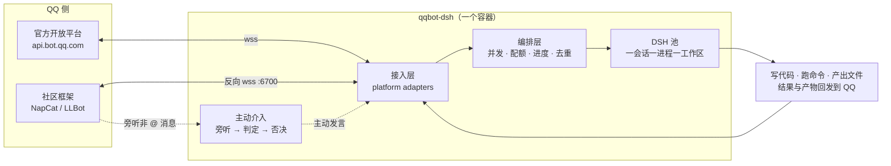

# qqbot-dsh

> **把 DeepSeek Harness（DSH）接进 QQ。** 一个服务、多个出口、会主动说话的群聊 agent。

三个亮点，决定了它和常见 QQ 机器人不一样：

| | 亮点 | 一句话 |
|---|---|---|
| ⚙️ | **完整 agent 能力** | 内核是 [DSH](https://www.npmjs.com/package/@deepseek-ai/dsh)：每个会话一个独立进程 + 独立工作区，能真的写代码、跑命令、读文件、多步干活并交付产物 |
| 🔌 | **一套服务，多套出口** | 官方开放平台与社区框架（OneBot v11）**可同时在线**，编排层以上只有一条代码路径；接入差异全部收在适配器里 |
| 💬 | **主动发言** | 不只对 @ 反应：旁听群聊 → 判断该不该开口 → 五类场景下主动插话，带限流、每话题一次、「没人理我就停」等硬闸门 |



| 通道 | 接入方式 | 旁听（听得到没 @ 的消息） | 主动发言 |
|---|---|---|---|
| **官方开放平台** `qq-official` | 主动 wss 连出 api.bot.qq.com，需审核 | 需开通「接收所有消息」能力 | ❌ 平台不支持（主动推送已停用、群聊每月 4 条） |
| **社区框架** `onebot` | 反向 WebSocket 连入 `:6700`，**免审核** | ✅ | ✅ |

---

## 快速开始

只支持 Docker 部署。`qqbot.yml` 随仓库提供（= 默认配置，带注释，**不用复制**），
所以起步只有两步：**填 `.env` → `docker compose up -d --build`**。

要填哪些凭证，取决于走哪条通道（默认配置里两条都开着，不用就把另一条从
`qqbot.yml` 的 `connectors` 里删掉）：

| 通道 | `.env` 里必填 | 说明 |
|---|---|---|
| **社区框架**（推荐） | `DEEPSEEK_API_KEY`、`ONEBOT_ACCESS_TOKEN` | 免审核；`connectors: [onebot]` |
| **官方开放平台** | `QQ_APP_ID`、`QQ_APP_SECRET`、`DEEPSEEK_API_KEY` | 需审核；`connectors: [qq-official]` |

```sh
cp .env.example .env
docker compose up -d --build
docker compose logs -f
```

启动后在群里 @机器人、或直接私聊说一句需求。**完整步骤与常见坑见
[docs/DEPLOY.md](docs/DEPLOY.md)**；社区框架那条路还要多做一步反向 WS 配置（见下）。

### 走社区框架：接上反向 WebSocket

`.env` 填好后，在框架（NapCat / LLBot）里加一条**反向 WebSocket** 指向
`ws://127.0.0.1:6700/onebot/v11/ws`，token 与 `ONEBOT_ACCESS_TOKEN` 一致。
6700 端口默认已映射（只绑 loopback，不对局域网开放），所以框架跑在宿主即可连上。

框架选型（macOS 实测：**NapCat 有头形态掉线率明显更低**）、必踩的端口/图形会话坑、
完整反向 WS 配置：见 **[DEPLOY 第 3.1 节](docs/DEPLOY.md)**。

> ⚠️ 社区框架基于 NTQQ 协议，存在账号风控风险，**建议用专门的小号**。这是平台风险，与代码无关。

### 可选：打开主动发言

默认**关闭**；即使打开也先进入**灰度观察**（判定照跑、只记录"本应发言"，不真的发）。

```ini
# .env（群号是个人标识，只在这里配）
BOT_LISTEN_GROUPS=onebot:123456      # 白名单；留空 = 不接任何群
BOT_PROACTIVE_ENABLED=true           # 总开关
BOT_PROACTIVE_DRY_RUN=true           # 默认值：先观察，确认判据准了再改 false
```

```bash
# 可选：兴趣池（场景 5）。仓库里已有一份近乎为空的 interests.yml 占位，
# 空池 = 场景 5 不触发（其余四个场景不受影响）。要真的用起来，照样例填：
cp src/pipeline/proactive/interests/interests.yml.example interests.yml
```

> ⚠️ 别删掉宿主上的 `interests.yml` / `qqbot.yml`：compose 是 bind mount，
> 文件不存在时 Docker 会**自动建一个同名目录**，容器启动会直接失败。

它**会在什么情况下开口**，用人话写在
**[SCENES.md](src/pipeline/proactive/interests/SCENES.md)**：五类场景（指代 / 续聊追问 /
无人应答 / 持续讨论 / 兴趣话题）+ 全局闸门（没人理我就停、限流、每话题一次、夜间静默）。
灰度期间看 `curl -s localhost:8080/health | jq .proactive` 的 `wouldSend`；
"它为什么不说话"的排查顺序见 **[RUNBOOK §4.5](docs/RUNBOOK.md)**。

---

## 它特别处理了什么

QQ 机器人的约束比看起来紧得多。挑几条最有代表性的（完整清单见 [DESIGN](docs/DESIGN.md)）：

| 平台约束 | 处理方式 |
|---|---|
| 被动窗口只有**群聊 5 分钟 / 单聊 60 分钟**，每条消息最多回 **5 / 4 次** | 回复配额账本 + 进度回执，永远给最终答案留配额；`msg_seq` 统一分配避免平台去重 |
| `session/prompt` **没有 resume 语义**，进程重启必失忆 | 桥接层自维护对话记录，runtime 重建时按边界标记回放 |
| `initialize.cwd` 是**进程级**的 | 一会话一进程一工作区，会话之间互相看不到文件 |
| 用户发来的**文件**是字节、模型读不了 | 落 `inbox/` 供 agent 深挖 + 抽取正文（PDF 走 `pdftotext`），以不可信内容边界进 prompt；解析器缺失自动降级 |
| 一轮产出多个文件会刷屏 | 自动打包成单个 zip 发一条；只发本轮新产生的文件 |
| 主动推送能力官方已停用 | 收敛成一个平台能力：官方层 do nothing，社区框架直接发，**外层一条逻辑** |

## 权限模型（请务必了解）

**workspace-write + 无人值守审批桩**：agent 在工作区内可自由读写执行；工作区之外由沙箱挡住；
无头环境里的审批由桩自动放行（否则工具调用会被 fail-closed 拒绝）。

⚠️ **关键前提**：沙箱需要可用后端（Linux 上 `bwrap` 或 `Landlock`）。两者都不可用时，
`workspace-write` 会退化为**事实上的完全访问**——此时容器本身（只读根文件系统、
`cap_drop: ALL`、资源上限、非 root）才是真正的边界。确认你的部署属于哪种：

```sh
docker compose run --rm --entrypoint node qqbot scripts/verify-sandbox-capability.mjs
```

`SANDBOX-EFFECTIVE` = 边界有效；`DEGRADED` = 已降级（处置见 [DEPLOY 第 5 节](docs/DEPLOY.md)）。
残余风险（agent 可执行任意代码并出网、API Key 在容器内可见）见 [DESIGN 6.4](docs/DESIGN.md)。

---

## 文档

| 文档 | 内容 |
|---|---|
| [docs/DESIGN.md](docs/DESIGN.md) | 方案设计：架构、多接入模型、协议契约、硬约束落地、权限与安全 |
| [docs/DEPLOY.md](docs/DEPLOY.md) | 部署手册：从零到跑通，含框架选型与调参建议 |
| [docs/RUNBOOK.md](docs/RUNBOOK.md) | 排障手册：按症状组织的排查流程（主动发言见 §4.5） |
| [SCENES.md](src/pipeline/proactive/interests/SCENES.md) | **主动介入场景的自然语言真相源**：什么情况下会说、典型对话、红线 |
| [proactive/README](src/pipeline/proactive/README.md) | 主动发言模块：能力收敛、三层判定架构、降级链 |
| [proactive/AGENT-CONTRACT](src/pipeline/proactive/AGENT-CONTRACT.md) | 扩展契约（给 agent 读）：新增介入规则 / 新增平台 / 改场景表 |
| [PROACTIVE-INTERVENTION-ARCH](docs/PROACTIVE-INTERVENTION-ARCH.md) | 主动介入架构方案：5 场景 → 三段式架构、取舍与未实现项 |

## 开发

```sh
npm install
npm run typecheck
npm test                 # 离线单测：不触网、不启动 DSH 子进程
```

**改了东西要怎么生效**（没有热更新，但只有改后端代码才需要重建镜像）：

| 改动 | 命令 | 重建镜像 |
|---|---|---|
| `src/**` 后端代码 | `docker compose up -d --build` | 是 |
| `.env`（密钥 / 开关 / 白名单） | `docker compose up -d` | 否 |
| `qqbot.yml`、`interests.yml`（挂载的配置） | `docker compose restart qqbot` | 否 |
| 某个会话的规矩（工作区里的 `AGENTS.md`） | 直接写文件，连重启都不用 | 否 |

> `.env` 是**容器创建时**注入的：`restart` 不会重读它，所以那一行必须是 `up -d`。

**永远不需要 `docker compose down`**。想跳过镜像构建调试：用 `docker-compose.dev.yml`
挂本地 `dist`（见 [DEPLOY 第 8 节](docs/DEPLOY.md)）。

### 容器内验证脚本（需要真实 `DEEPSEEK_API_KEY`，会调用一次模型）

```sh
docker compose run --rm --entrypoint node qqbot scripts/smoke-dsh.mjs       # 端到端驱动一轮 DSH
docker compose run --rm --entrypoint node qqbot scripts/smoke-web-fetch.mjs # 验证 web_fetch 真能抓到正文
docker compose run --rm --entrypoint node qqbot scripts/verify-sandbox.mjs  # 判定沙箱是否真闸
docker compose run --rm --entrypoint node qqbot scripts/probe-dsh.mjs       # 诊断 profile 组合问题
```

## 目录结构

```
docker-compose.yml       生产部署入口（qqbot.yml / interests.yml 以只读方式挂进来）
docker-compose.dev.yml   开发覆盖：挂本地 dist，跳过镜像重建
.env.example             密钥与个人标识样例（不含行为参数）
qqbot.yml                行为配置（随仓库提供 = 默认值，带注释直接用）

src/core/                接入层契约：BotConnector / 归一化事件 / 内容片段（编排层只依赖这里）
src/adapters/            接入平台：qq-official（官方）/ onebot（社区框架）
src/dsh/                 DSH 桥接：JSON-RPC 客户端 / 子进程监督 / 进程池 / turn 归并 / 图片内联
src/pipeline/            编排：调度 / 配额与进度 / 分段 / 并发原语（全平台共用一条链路）
src/pipeline/proactive/  主动发言聚集地：SCENES.md + 兴趣池 + 搜集/判定/否决/投递四层
src/store/               持久化：对话记录（JSONL）/ 事件去重 / 会话映射 / 路径布局
dsh-profile/             DSH profile 补丁 + 自动审批桩
scripts/                 容器入口 + 验证脚本
tests/                   离线单测（556 条）
docs/                    方案设计 / 部署手册 / 排障手册
```

## 许可与来源

依赖 [@deepseek-ai/dsh](https://www.npmjs.com/package/@deepseek-ai/dsh)（MIT）。
QQ 协议实现依据**实况官方文档**（<https://bot.q.qq.com/wiki/develop/api-v2/>），
不使用已停更的 `tencent-connect/bot-docs` 作为依据——详见 [DESIGN 第 9 节](docs/DESIGN.md)。
